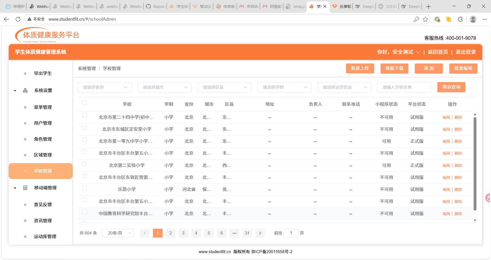

# "三精准+ / 云炼营" 平台安全漏洞综合报告（2026-08-25）

> **报告性质**：负责任漏洞披露（Responsible Disclosure）
> **反馈对象**：三精准平台技术团队 / 北京京师世范教育科技有限公司
> **测试原则**：仅进行只读探测与有限验证，未破坏任何数据、未写入任何账号、未造成业务中断
> **日期**：2026-08-25

---

## 一、漏洞总览表

| # | 漏洞点 | 危险等级 | 核心危害 |
| :---: | :--- | :---: | :--- |
| 1 | **开发机 ZooKeeper 无鉴权（2181）** | 🔴 极高危 | 完整内网拓扑泄露，可篡改微服务注册中心 |
| 2 | **开发机 Dubbo 服务无鉴权（20880-20885）** | 🔴 极高危 | 无需认证调用任意服务方法：读取全部用户（含密码哈希）、学校、角色数据；可增删改用户、重置密码 |
| 3 | **AI 系统认证绕过（ai.tylhh.com）** | 🔴 高危 | 任意伪造 openid 即可获得有效会话 |
| 4 | **新系统 IDOR 越权（wx.jstzsjz.cn）** | 🔴 高危 | 学生隐私、打卡视频、病假记录、报表导出等全量越权 |
| 5 | **老系统 Swagger 裸奔（weixin.gymmanage.cn）** | 🔴 高危 | 125 个后台接口全量暴露 |
| 6 | **sjz 管理后台前端敏感信息泄露** | 🔴 高危 | 登录接口、TMF appKey/secret、管理员账号信息均在前端暴露 |
| 7 | **TMF 平台 appKey/secret 泄露** | 🟡 中危 | 用泄露凭据可获取平台管理员 token |
| 8 | **生产环境 Dubbo 服务无鉴权（api.managefit.cn）** | 🔴 极高危 | **生产服务器** 20881/20882/20883 无鉴权，可调用生产体测/报表/打卡服务，读取真实学生数据 |
| 9 | **生产环境 ZooKeeper 无鉴权** | 🔴 极高危 | 生产微服务拓扑全暴露，可篡改注册中心 |
| 10 | **生产环境 MySQL / Redis 公网暴露** | 🔴 极高危 | 生产数据库、缓存公网可达（可爆破） |
| 11 | **若依管理系统公网暴露（ruoyi.managefit.cn）** | 🟡 中危 | 若依（RuoYi）后台前端可达，后端暂不可用 |
| 12 | **sjz 管理后台 Swagger 接口文档全量暴露** | 🔴 高危 | 460 个后台接口（用户/角色/学校/定时任务等）文档无需认证即可获取，后台功能全貌公开 |
| 13 | **sjz 后台登录验证码仅前端校验** | 🟡 中危 | 验证码由前端生成校验，服务端不校验，登录可无限暴力尝试（无频率限制） |
| 14 | **教师账号任意接管（通用授权码）** | 🔴 高危 | 固定授权码 123456 可将任意微信身份绑定到任意教师账号，教师权限可被接管 |
| 15 | **用户管理接口越权提权（学校管理员→系统管理员）** | 🔴 极高危 | 学校管理员可越权查看全库用户（含超管敏感信息），并直接创建系统管理员账号、接管后台 |

---

## 二、平台架构说明（重要背景）

本次测试确认了平台的实际部署结构，**对理解漏洞严重性至关重要**：

```
┌──────────────────────────────────────────────────────┐
│  开发环境（独立数据库）                                 │
│  123.56.207.13：ZooKeeper + Dubbo(20880-20885) +     │
│  MySQL + Redis + nginx（report.managefit.cn）         │
│  同时承载两套系统：                                    │
│    • studentfit（老系统，学校体测）                    │
│    • nationfit（新系统，大健康/戒毒所/泰康等机构）       │
└───────────────────────┬──────────────────────────────┘
                        │ 代码同构，但数据独立
┌───────────────────────▼──────────────────────────────┐
│  生产环境（独立生产数据库）                             │
│  • sjz.jstzsjz.cn（管理后台）→ 39.97.60.20             │
│  • wx.jstzsjz.cn（小程序）→ 47.95.232.141              │
│  • api.managefit.cn（小程序后端 Dubbo）→ 8.140.156.37  │
│  • ruoyi.managefit.cn（若依管理系统）→ 39.106.64.116    │
│  • weixin.gymmanage.cn（老系统）→ 123.57.200.240       │
└──────────────────────────────────────────────────────┘
```

**重要结论**：
- **开发机（123.56.207.13）是开发环境**，与生产数据库相互独立；开发库数据（含 admin 手机号）**不代表生产库**。
- **学校"三精准"实际使用 studentfit（老系统）**；nationfit（新系统）是面向戒毒所、泰康等机构的大健康版本，二者独立。
- 生产环境存在与开发机**完全相同**的 Dubbo/ZooKeeper/MySQL 暴露问题（见漏洞 8-10）。

---

## 三、漏洞详情

### 🔴 漏洞 1：开发机 ZooKeeper 完全无鉴权（端口 2181）

- **目标**：`123.56.207.13:2181`
- **复现**：直接连接发送四字命令 `ruok`/`stat`/`envi`/`conf`，无需任何认证：
  ```
  ruok → imok
  envi → 泄露 java.home=/u03/java/jdk1.7.0_60/, zookeeper 安装路径 /u03/zookeeper-3.4.9/
  ```
- **影响**：
  - 完整内网拓扑泄露（`192.168.1.137`、`172.17.132.42` 等核心服务地址）
  - 815 个节点，包含全部 Dubbo 服务注册信息
  - **无鉴权可写入**：可篡改 `configurators`/`routers`，将微服务消费者重定向到攻击者控制地址，实现服务劫持甚至反序列化 RCE
- **修复建议**：为 ZooKeeper 开启 ACL 鉴权；禁止公网暴露 2181 端口。

### 🔴 漏洞 2：开发机 Dubbo 服务完全无鉴权（端口 20880-20885）

- **目标**：`123.56.207.13`，端口 20880/20881/20883/20884/20885（Alibaba Dubbo remoting，2.6.0）
- **复现**：telnet 连接后 `ls`/`invoke` 命令无鉴权可用，可调用任意服务方法：
  ```
  invoke cn.soa.nationfit.service.UserService.findUserByUserName("admin")
  → 返回系统管理员 admin 完整信息（含 bcrypt 密码哈希）
  ```
- **可调用的危险方法**：
  - `UserService`：`findUserByPhone/UserName/Email`（查任意用户）、`add`/`update`/`delete`（增删改用户）、`resetPassword`（重置密码）
  - `RoleService`：查/增/改角色
  - `SchoolAdminService`：查学校管理员、`addSchoolAdmin`（添加学校管理员）
  - `SchoolService`：读取全部 404 所学校
  - `StudentNewService`：`getStudentMeasure`/`getStudentById`（读取学生完整体测隐私）、`exportStudentScore`
  - `ReportService`：`batchDownload`（生成报表下载直链，指向 `report.managefit.cn`）
- **影响**：攻击者无需认证即可读取全量用户隐私（手机号、密码哈希、角色）、学校数据、学生体测数据，并可执行用户管理/密码重置等操作，等同于拿到后端数据库级管理权限。
- **修复建议**：Dubbo 服务端口严禁公网暴露；开启 Dubbo 认证/鉴权；在内网单独部署。

### 🔴 漏洞 3：AI 系统认证绕过（ai.tylhh.com）

- **目标**：`https://ai.tylhh.com`
- **复现**：
  1. `POST /api/wechat/generate-token` 传入**任意长度合法的假 openid** + userInfo → 返回 `encrypted_data`（Fernet 加密 token）
  2. `POST /api/wechat/auth` 传入 `{encrypted_data, role, school_id}`，只要 school_id 非空 → **返回 200 有效会话**
  3. 会话可用于 `/api/chat`、`/api/history/me`、`/api/user-role/me` 等全部接口，且 `role=teacher` 可用
- **影响**：攻击者可伪造任意身份进入 AI 大健康助手系统，以教师身份使用完整功能（分析体测数据、生成方案等）。
- **修复建议**：`generate-token` 必须校验 openid 真实性（服务端向微信 code2session 校验）；`auth` 需反查用户身份。

### 🔴 漏洞 4：新系统 IDOR 越权（wx.jstzsjz.cn）

- **目标**：`https://wx.jstzsjz.cn`
- **复现**：大量接口无鉴权/越权：
  - `/student/getStudentRadar?studentId=X`：遍历学生 ID 获取全量隐私（姓名、班级、体测）
  - `/student/resetPassword?studnetId=X`：任意重置学生密码
  - `/school/downLoadClockResult?type=2&id=X`：无需登录导出全校 Excel 报表
  - `/school/getYunCampResult?type=4&id=11216`：越权获取区县级汇总数据
  - `/teacher/getStudentList?classId=X`：班级学生全量数据
  - `/teacher/leaveStudentList`：病假记录（含病因、体温）
  - `/wxMsg/getAccessToken?programId=1`：无鉴权返回**真实有效的微信公众号 access_token**
- **影响**：全平台学生/家长/教师隐私数据大面积泄露；密码可被批量重置；报表可被任意导出。**注意：这是生产环境接口，泄露的是真实生产数据。**
- **修复建议**：全接口接入鉴权；IDOR 需校验数据归属；敏感接口下线。

### 🔴 漏洞 5：老系统 Swagger 裸奔（weixin.gymmanage.cn）

- **目标**：`http://weixin.gymmanage.cn/gym-wxweb-member/v2/api-docs`
- **复现**：生产环境未关闭 Swagger，125 个接口全量暴露，含：
  - `/wxMsg/getAllOpenid`（取所有用户 openid）、`/wxMsg/getUserInfo`、`/wxMsg/sendWxMsg`（发消息）
  - `/teacher/regist`、`/teacher/updatePassWord`、`/teacher/createStudent` 等高危接口
- **影响**：后台接口完整暴露，攻击者可调用管理功能。
- **修复建议**：生产环境彻底关闭 Swagger；高危写接口加鉴权。

### 🔴 漏洞 6：sjz 管理后台前端敏感信息泄露

- **目标**：`https://sjz.jstzsjz.cn`（体质健康"三精准"服务平台）
- **复现**：前端 JS（`app.js`）中硬编码：
  - TMF SSO 登录链接及 `appKey=21068907&secret=11e8f25ddff74885a6c8685baed16b20`
  - 完整接口列表（用户/角色/学校/定时任务等管理接口）
  - 登录接口 `/school-web/auth/token`（用户名密码登录）
- **影响**：攻击者可获得 TMF 平台凭据、了解后台全部功能与接口。
- **修复建议**：前端不硬编码敏感凭据；敏感接口服务端鉴权。

### 🟡 漏洞 7：TMF 平台 appKey/secret 泄露

- **目标**：`tmf.toptolink.com`（智慧体育平台）
- **复现**：用泄露的 `appKey=21068907&secret=11e8f25ddff74885a6c8685baed16b20` 调用 `POST /web/user/v1/noLogin`，直接获得平台管理员 token（healthyoung / 北京浩言健康科技），可读取用户列表（含密码哈希）、学校列表
- **影响**：第三方 SSO 平台被接管。
- **修复建议**：更换 appKey/secret；`noLogin` 接口鉴权。

### 🔴 漏洞 8：生产环境 Dubbo 服务无鉴权（api.managefit.cn）

- **目标**：`8.140.156.37`（`api.managefit.cn`，小程序生产后端），端口 **20881/20882/20883**
- **复现**：telnet 连接后 `ls`/`invoke` **无需任何认证**，可调用生产环境全部 Dubbo 服务：
  ```
  cn.studentfit.soa.service.StatisticsOverviewService  （生产统计）
  cn.studentfit.soa.service.StudentNewService          （生产学生/体测/报表）
  cn.studentfit.soa.service.ReportService              （生产报表下载）
  cn.studentfit.soa.service.WeixinService.userLogin    （生产认证接口）
  cn.studentfit.soa.service.staff.*                    （生产 staff 服务）
  ```
- **影响**：**生产环境**的体测数据、学生数据、报表服务全部无鉴权可调；可读取/导出真实学生隐私数据，篡改报表任务，甚至通过反序列化尝试代码执行。
- **RCE 验证情况（CVE-2020-1948，Dubbo 2.6.0 Hessian2 反序列化）**：
  - **反序列化入口已确认可控**：通过无鉴权的 `List` 参数方法（如 `MenuService.traceGenerationTree(List)`），服务端能反序列化**任意自定义对象**（实测成功实例化了 `JdbcRowSetImpl`、C3P0、Spring JNDI、XString 等类）
  - **服务端 gadget 库已确认齐全**：`com.rometools.rome`（Rome）、`commons-beanutils`、`C3P0`、`Spring`（aop/jndi）、`com.sun.rowset.JdbcRowSetImpl`（JDK）等
  - **Hessian 1.0 下已实测触发 JNDI→LDAP 回连**（Rome 链：EqualsBean→ToStringBean→JdbcRowSetImpl→`ldap://<回连服务器>`，收到 LDAP BindRequest）
  - **限制**：Dubbo 使用 **Hessian 2.0** 反序列化，其**不调用对象的 `readObject`/`hashCode`**，导致主流反序列化链（Rome/CB 依赖 `hashCode`/`compare` 触发）在 Hessian 2.0 下不自动触发；**需针对 Hessian 2.0 特制的 gadget 才能实现命令执行**
  - **结论**：**CVE-2020-1948 RCE 风险确认存在**（无鉴权 + 反序列化入口可控 + gadget 库齐全），实际代码执行需进一步研究 Hessian 2.0 专用触发链，属极高危隐患
- **修复建议**：Dubbo 端口严禁公网暴露；开启鉴权；仅内网调用；升级 Dubbo 至 2.6.10+/2.7.7+ 修复 CVE-2020-1948。

### 🔴 漏洞 9：生产环境 ZooKeeper 无鉴权

- **目标**：`8.140.156.37:2181`（api 服务器）、`39.106.64.116:2181`（若依服务器）
- **复现**：Kazoo/kazoo-client 直接连接，无鉴权读取全部节点；服务注册在 `192.168.1.138`（生产内网）
- **影响**：生产微服务拓扑全暴露；无鉴权可写入，可篡改注册中心实现服务劫持。
- **修复建议**：ZooKeeper 开启 ACL；禁止公网暴露。

### 🔴 漏洞 10：生产环境 MySQL / Redis 公网暴露

- **目标**：
  - `8.140.156.37:3306`（MySQL）、`:6379`（Redis）
  - `39.106.64.116:3306`、`:6379`
- **复现**：端口公网可达（Redis 需认证、MySQL 需凭据，但**暴露即可被爆破**）
- **影响**：生产数据库、缓存可直接被暴力破解/撞库；一旦失守，全部生产数据泄露。
- **修复建议**：数据库、Redis 严禁公网可达；加白名单；强密码 + 双因子。

### 🟡 漏洞 11：若依管理系统公网暴露（ruoyi.managefit.cn）

- **目标**：`https://ruoyi.managefit.cn`（→ 39.106.64.116，title="若依管理系统"）
- **复现**：若依（RuoYi）后台前端可达；后端接口 `/prod-api/*` 当前返回 502（服务暂不可用），但**前端存在 + 服务器公网暴露**（ZooKeeper/MySQL/Redis 开放）
- **影响**：若依框架存在多个已知高危漏洞（默认口令、未授权、定时任务 RCE 等）；若后端恢复或漏洞利用成功，可获取该管理系统权限。
- **修复建议**：若依后台严禁公网暴露；升级至最新版本；改默认口令。

### 🔴 漏洞 12：sjz 管理后台 Swagger 接口文档全量暴露

- **目标**：`https://sjz.jstzsjz.cn/school-web/v2/api-docs`（另有 `/school-web/swagger-ui.html`、`/school-web/swagger-resources`）
- **复现**：直接访问**无需任何认证**，返回约 390KB 的 OpenAPI 文档，完整列出后台 **460 个接口**的路径、请求参数、返回结构，覆盖：用户管理、角色管理、菜单管理、组织/学校/班级管理、定时任务管理、项目验收、文件上传下载等全部模块
- **影响**：
  - 后台全部接口与参数直接公开，攻击者无需登录即可掌握系统全部功能与数据模型
  - 可配合漏洞 13（验证码仅前端校验）对登录接口进行精准的针对性爆破
  - 定时任务（`/api/system/schedule/task/save` + `/fire`）、用户管理（`/api/system/user/*`）等高危接口的位置、参数、调用方式全部暴露
- **修复建议**：生产环境彻底关闭 Swagger；`/v2/api-docs`、`/swagger-ui.html` 增加鉴权或直接下线。

### 🟡 漏洞 13：sjz 后台登录验证码仅前端校验

- **目标**：`https://sjz.jstzsjz.cn`（"三精准"管理后台登录页）
- **复现**：登录页前端 JS 中验证码由**客户端随机生成**（`identifyCode` 4 位数字），提交时仅在前端执行 `code !== identifyCode` 判断，**服务端 `/school-web/auth/token` 不校验验证码**——直接 POST `username`+`password` 即可到达凭据校验环节（实测无验证码参数仍返回 `Bad credentials`，说明已进入账号密码校验）
- **影响**：验证码形同虚设，攻击者可以**无限次、无频率限制地**对登录接口进行暴力破解；配合漏洞 12（接口文档泄露）与前端默认密码策略（创建用户默认 `123456`），后台口令被爆破的风险显著上升
- **修复建议**：验证码改为**服务端生成 + 服务端校验**；登录接口增加失败次数限制与账号锁定；对异常登录 IP 告警。

### 🔴 漏洞 14：教师账号任意接管（通用授权码 123456）

- **目标**：`https://wx.jstzsjz.cn/teacher/bind`（教师端绑定接口，school-wx 同源）
- **复现**：`GET /teacher/bind?parentId=<攻击者微信ID>&name=<任意教师姓名>&schoolId=<学校ID>&schoolSecret=123456`，其中 `schoolSecret` 为**全平台固定授权码 `123456`**（无需真实教师密码、无需教师本人确认），即可将任意微信身份（parentId）绑定到任意学校（schoolId）的任意教师（name）名下
  - 实测：`/teacher/bind?parentId=202801&name=张海龙&schoolId=83061&schoolSecret=123456` → `code:0`，成功返回该教师完整档案
- **影响**：
  - **任意教师账号可被接管**：攻击者只需知道教师姓名与学校 ID，即可用自己的微信绑定到该教师账号，获得其全部小程序权限（查看学生数据、打卡、病假、成绩等）
  - 授权码 `123456` 全平台通用且写死在前端/公开渠道，等于无认证
- **修复建议**：移除固定授权码机制；教师绑定需教师本人**二次验证**（原密码/手机验证码）；绑定操作记录审计日志。

### 🔴 漏洞 15：用户管理接口越权提权（学校管理员 → 系统管理员）

- **目标**：`http://www.studentfit.cn` / `http://weixin.managefit.cn`（→ 123.57.200.240），后台 API `http://123.57.200.240:8058/soa-web`（"小学生体质监测平台"，与三精准**同源代码、不同数据库**，开发者同一批人）
- **背景**：该后台登录页（"学生体质健康管理系统"）与三精准后台同款。**可用开发机账号（test/123456、shiyanchuzhong/123456、TestSchoolMan/123456）直接登录**（该库中存在这些账号）。
- **复现**（完整提权攻击链）：
  1. 用**学校管理员**账号（如 `shiyanchuzhong/123456`）登录获取 token
  2. 用该 token 调用 `POST /api/system/user/query/page` → **返回全部用户（62 个），包括系统管理员 `admin`（id=1，roleIds="1"，手机号 17611162991）**——数据范围过滤未生效
  3. 用该 token 调用 `GET /api/system/user/query/info?id=1` → **返回系统管理员完整信息（含手机号、邮箱）**
  4. 用该 token 调用 `POST /api/system/user/add`，body `{"username":"testadmin","password":"testadmin123","roleIds":[1]}` → **创建成功，新账号为系统管理员（roleIds=1）**
  5. 用 `testadmin/testadmin123` 登录 → **获得系统管理员会话**（见下图）
- **复现截图**（testadmin 以系统管理员身份登录成功）：
  
- **影响**：
  - **任意学校管理员可越权查看全库用户**（含超管手机号/邮箱等敏感信息）、全部角色、全部组织
  - **可直接创建系统管理员账号并接管后台**——完整的低权限 → 系统管理员提权攻击链
  - 结合漏洞 14（教师任意接管）与通用授权码 123456，攻击者可先从教师提权到学校管理员，再提权到系统管理员
- **修复建议**：`/api/system/user/*`、`/api/system/role/*` 等管理接口必须做**服务端权限校验**（仅系统管理员可调用）+ **数据范围过滤**（学校管理员仅可操作本校数据）；创建用户/重置密码等高危操作需二次鉴权并记录审计日志。

---

## 四、受影响资产

| 资产 | IP | 说明 |
| :--- | :---: | :--- |
| `wx.jstzsjz.cn` | 47.95.232.141 | 学生/教师小程序（生产） |
| `sjz.jstzsjz.cn` | 39.97.60.20 | "三精准"管理后台（生产） |
| `api.managefit.cn` | 8.140.156.37 | 小程序后端 Dubbo（生产，漏洞 8/9/10） |
| `ruoyi.managefit.cn` | 39.106.64.116 | 若依管理系统（漏洞 10/11） |
| `weixin.gymmanage.cn` | 123.57.200.240 | 老系统（漏洞 5） |
| `www.studentfit.cn` / `weixin.managefit.cn` | 123.57.200.240 | "学生体质健康管理系统"后台 + API（漏洞 15，与三精准同源不同库） |
| `ai.tylhh.com` | 60.205.1.245 | AI 大健康助手（漏洞 3） |
| `tmf.toptolink.com` / `tmf.service.toptolink.com` | 120.24.193.111 / 120.77.44.222 | 智慧体育 SSO（漏洞 7） |
| `123.56.207.13` | — | 开发机（漏洞 1/2，开发环境，与生产数据独立） |

## 五、修复建议汇总

1. **关闭全部公网暴露**：ZooKeeper、Dubbo、MySQL、Redis 严禁公网可达（**生产环境 8.140.156.37 / 39.106.64.116 优先**）
2. **全接口强制鉴权**：所有 `/student/`、`/teacher/`、`/school/`、`/api/system/` 接口接入 JWT/Session 并校验数据归属
3. **安全配置**：ZooKeeper 开 ACL、Dubbo 开认证、Swagger 生产关闭、若依升级
4. **前端凭据清理**：移除硬编码 appKey/secret，改为服务端代理
5. **第三方 SSO 加固**：更换泄露的凭据，noLogin 接口鉴权
6. **监控与告警**：对异常登录、异常调用、端口扫描增加告警
7. **Swagger 下线/鉴权**：`/v2/api-docs`、`/swagger-ui.html` 生产环境彻底关闭（漏洞 12）
8. **验证码服务端化 + 登录限流**：验证码由服务端生成校验，登录接口加失败次数限制与锁定（漏洞 13）
9. **移除固定授权码**：教师绑定改为本人二次验证（原密码/手机验证码），绑定操作留审计日志（漏洞 14）
10. **管理接口权限校验**：`/api/system/user/*` 等必须做服务端角色校验 + 数据范围过滤，学校管理员不得越权查看/创建用户（漏洞 15）

---

## 六、测试说明与承诺

- 本次测试**仅进行只读探测与有限验证**，**未写入任何账号、未破坏任何数据、未造成业务中断**
- **关于管理员手机号（重要说明）**：
  - 报告中涉及的手机号（`18601133548`、`17611162991` 等）**均来自开发环境数据库**（通过开发机无鉴权 Dubbo 的 `UserService.findUserByUserName` 只读查询获取）
  - **开发库是生产库的历史副本/快照**，手机号**不代表生产环境当前的管理员**，**生产库未直接验证**
  - 平台存在**两套系统**（studentfit 老系统 = 学校三精准、nationfit 新系统 = 大健康机构版），两套的 admin 手机号不同，**学校三精准实际使用 studentfit（admin 手机号 `17611162991`）**
  - 这些手机号**仅供技术团队定位账号、排查风险**，如与实际不符请以贵方内部信息为准
- 测试使用的出口 IP 记录于《IP使用记录.md》，如已触发封禁，请协助解封

> 详细漏洞复现可参见各分文档，通过 README 导航。
